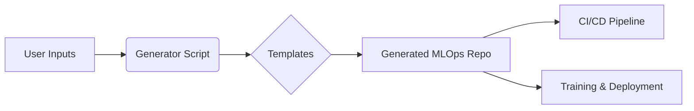

# Meta-MLOps Project Generator

A production-ready **MLOps Project Generator** that scaffolds tailored machine learning repositories based on user specifications. This system acts as a "Cookiecutter on Steroids," allowing data scientists to generate fully configured MLOps projects with built-in best practices for version control, experimentation, and deployment.

## 🚀 Features

- **Dynamic Scaffolding**: Generates projects tailored to specific needs:
  - **Task Type**: Supervised (Classification/Regression) or Unsupervised (Clustering).
  - **Data Type**: Tabular, Image, or Database.
  - **Deployment**: Ray Serve (Online), Ray Data (Batch), or None.
- **Production-Ready Components**:
  - **Git + DVC**: Pre-configured for code and data versioning.
  - **MLflow**: Integrated experimentation tracking.
  - **CI/CD**: Auto-generated GitLab CI/CD pipelines that run only on Pull Requests/Merges.
  - **Code Quality**: Pre-commit hooks (Black, Flake8, Mypy, Bandit).
- **Automated Setup**: Includes a unified `setup.sh` script to bootstrap the environment in seconds.

---

## 🏗 Architecture

This repository operates as a **Generator** (Meta-MLOps). It does not contain the active model code itself but rather the _templates_ and _logic_ to create them.



### Repository Structure

```
├── scripts/
│   └── scaffold_project.py   # The core generator logic (Jinja2-based)
├── templates/                # Jinja2 templates for the generated project
│   ├── dvc.yaml.template     # DVC pipeline template
│   ├── params.yaml.template  # Parameter configuration template
│   ├── gitlab-ci.yml.template# CI/CD pipeline template
│   ├── train_supervised.py   # Training script templates
│   └── setup.sh              # Unified setup script
├── src/                      # Source code components (Data Loaders, Deployment)
│   ├── data_loaders/         # Modular data loaders to be copied
│   └── deployment/           # Deployment logic to be copied
└── requirements.txt          # Dependencies for the GENERATOR itself
```

---

## 🛠 Installation & Usage

### Prerequisites

- **Python 3.11+**
- **Conda** (Miniconda or Anaconda)
- **Git**

### Option 1: Local Generation (CLI)

1.  **Clone the Generator Repository**:

    ```bash
    git clone <generator-repo-url>
    cd meta-mlops-generator
    ```

2.  **Install Dependencies**:

    ```bash
    pip install jinja2
    ```

3.  **Run the Scaffolder**:
    Use the `scaffold_project.py` script to generate a new project.

    ```bash
    python scripts/scaffold_project.py \
      --name my-churn-model \
      --task-type supervised \
      --data-type tabular \
      --deployment ray-serve \
      --output-dir ../projects
    ```

    **Arguments**:

    - `--name`: Name of the new project (Required).
    - `--task-type`: `supervised` (default) or `unsupervised`.
    - `--data-type`: `tabular` (default), `image`, or `database`.
    - `--deployment`: `ray-serve`, `ray-batch`, `all`, or `none`.
    - `--output-dir`: Directory where the new project will be created.

4.  **Initialize the New Project**:
    Navigate to the created directory and run the setup script.
    ```bash
    cd ../projects/my-churn-model
    ./setup.sh
    ```
    _This will create the conda environment, install dependencies, and configure Git/DVC hooks._

### Option 2: CI/CD Generation (GitLab)

This repository includes a **Project Generator Pipeline** that can be triggered manually from GitLab.

- Go to `Build > Pipelines` and click `Run pipeline`.
- The UI presents dropdowns and inputs for:
  - `PROJECT_NAME` (text)
  - `TASK_TYPE` (dropdown: `supervised`, `unsupervised`)
  - `DATA_TYPE` (dropdown: `tabular`, `image`, `database`)
  - `DEPLOYMENT` (dropdown: `all`, `ray-serve`, `ray-batch`, `none`)
- Run the pipeline.
- Open the job and download **Artifacts**. The archive contains:
  - `generated_projects/<PROJECT_NAME>/` (full generated repo)
  - `generated_projects/<PROJECT_NAME>.tar.gz` (portable bundle)

---

## 🧩 Customization

To modify the structure of _future_ generated projects, edit the files in the `templates/` directory:

- **`templates/dvc.yaml.template`**: Edit the DVC pipeline stages.
- **`templates/params.yaml.template`**: Add new hyperparameters or configuration sections.
- **`templates/gitlab-ci.yml.template`**: Update the CI/CD pipeline definition (e.g., change runner tags or docker images).
- **`src/`**: Add new data loaders or utility functions that should be copied to every new project.

---

## 📝 License

[Insert License Here]
